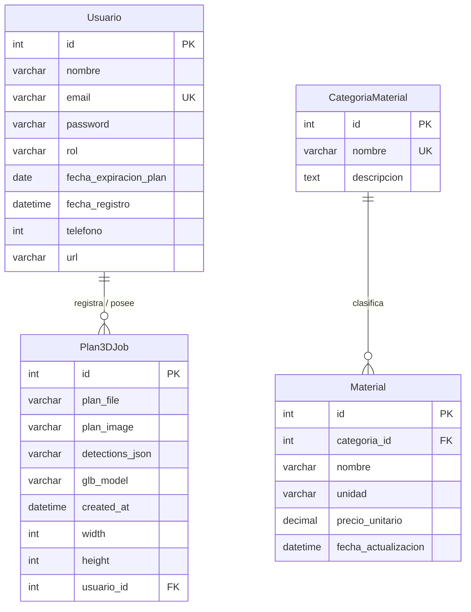

# Modelo de Base de Datos - Plan Risk 3D

Este archivo contiene la documentación detallada de la base de datos relacional para el backend de **Plan Risk 3D** (Django + PostgreSQL).

---

## 1. Diagrama Entidad-Relación (ERD)

---

## 2. Diccionario de Datos

### Tabla: `users_usuario` (Modelo: [Usuario](file:///d:/programablesw2/Plan_Risk_3D/back_plan_risk_3d/users/models.py#L5))
Almacena la información de los usuarios del sistema, sus roles (Normal o Premium) y el estado de sus suscripciones.

| Campo | Tipo | Restricciones | Descripción |
| :--- | :--- | :--- | :--- |
| `id` | Integer | Primary Key, Auto-increment | Identificador único de usuario. |
| `nombre` | VarChar(100) | Not Null | Nombre completo del usuario o empresa. |
| `email` | EmailField | Unique, Not Null | Correo electrónico (utilizado para el login). |
| `password` | VarChar(255) | Not Null | Contraseña encriptada. |
| `rol` | VarChar(20) | Choices, Default: `'usuario_normal'` | Roles permitidos: `'usuario_normal'`, `'usuario_premium'`. |
| `fecha_expiracion_plan` | Date | Nullable | Fecha límite del plan Premium adquirido. |
| `fecha_registro` | DateTime | Nullable | Fecha y hora en la que se registró la cuenta. |
| `telefono` | Integer | Nullable | Número de teléfono de contacto. |
| `url` | VarChar(255) | Nullable | Enlace o web de perfil. |

---

### Tabla: `plans_plan3djob` (Modelo: [Plan3DJob](file:///d:/programablesw2/Plan_Risk_3D/back_plan_risk_3d/plans/models.py#L6))
Guarda las órdenes o trabajos de procesamiento de planos 2D a modelos 3D y simulaciones.

| Campo | Tipo | Restricciones | Descripción |
| :--- | :--- | :--- | :--- |
| `id` | Integer | Primary Key, Auto-increment | Identificador único del trabajo de procesamiento. |
| `plan_file` | FileField | Not Null (Ruta archivo) | Archivo original cargado (PDF, DWG, DXF, PNG, JPG). |
| `plan_image` | ImageField | Nullable (Ruta imagen) | Imagen rasterizada utilizada por la red neuronal Mask R-CNN. |
| `detections_json` | FileField | Nullable (Ruta archivo) | Archivo JSON con las coordenadas y clases detectadas por la IA. |
| `glb_model` | FileField | Nullable (Ruta archivo) | Archivo tridimensional final listo en formato `.glb` / `.gltf`. |
| `created_at` | DateTime | Auto-now-add | Fecha y hora de creación del trabajo. |
| `width` | Integer | Default: `0` | Ancho del plano original. |
| `height` | Integer | Default: `0` | Alto del plano original. |
| `usuario_id` | Integer | Foreign Key (`users_usuario.id`), `ON DELETE SET NULL`, Nullable | Usuario propietario del plano. |

---

### Tabla: `presupuesto_categoriamaterial` (Modelo: [CategoriaMaterial](file:///d:/programablesw2/Plan_Risk_3D/back_plan_risk_3d/presupuesto/models.py#L6))
Categorías para organizar los insumos o materiales constructivos en la estimación de presupuestos.

| Campo | Tipo | Restricciones | Descripción |
| :--- | :--- | :--- | :--- |
| `id` | Integer | Primary Key, Auto-increment | Identificador único de la categoría. |
| `nombre` | VarChar(100) | Unique, Not Null | Nombre de la categoría (ej. Acero, Hormigón, Ladrillos). |
| `descripcion` | Text | Nullable | Detalle o notas adicionales de la categoría. |

---

### Tabla: `presupuesto_material` (Modelo: [Material](file:///d:/programablesw2/Plan_Risk_3D/back_plan_risk_3d/presupuesto/models.py#L17))
Catálogo de materiales con sus costos unitarios para realizar las estimaciones presupuestarias sobre el modelo 3D.

| Campo | Tipo | Restricciones | Descripción |
| :--- | :--- | :--- | :--- |
| `id` | Integer | Primary Key, Auto-increment | Identificador único del material. |
| `categoria_id` | Integer | Foreign Key (`presupuesto_categoriamaterial.id`), `ON DELETE CASCADE`, Nullable | Categoría a la que pertenece el material. |
| `nombre` | VarChar(100) | Not Null | Nombre del material (ej. Fierro de 1/2", Cemento Portland). |
| `unidad` | VarChar(20) | Default: `'m3'` | Unidad de medida (m3, m2, kg, bolsas, etc.). |
| `precio_unitario` | Decimal(12, 2) | Not Null | Costo por unidad en moneda local/dólares. |
| `fecha_actualizacion` | DateTime | Auto-now | Fecha de la última actualización de precio. |
